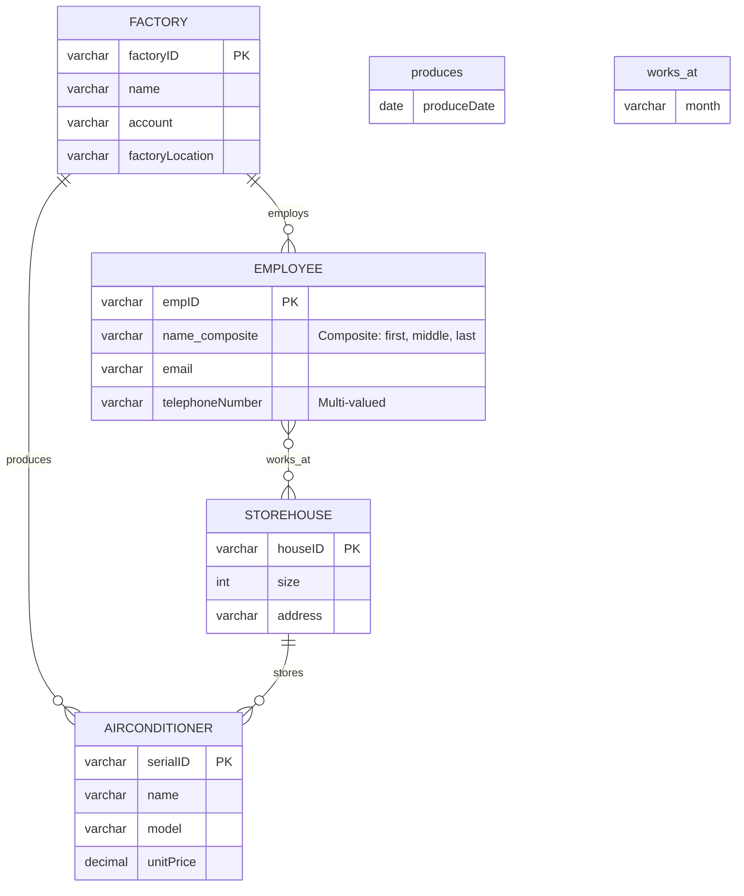

**1. (16 points) Choices**

(1) In the following statements, the correct ones are <u>A</u>.

I. At the stage of database logical design, E-R diagram is used to describe the properties of data objects in application areas and relationships among data objects.

II. The three levels of data abstractions are physical level, logical level and view level. 

III. A ticketing website has a B/S-like architecture. Its application programs are programmed in C++ and access database servers via ODBC interface. 

IV. In China, openGauss, Kingbase and Oracle are representative domestic open-source database systems.

A. I, II     B. II, III     C. I, III     D. III, IV

(2) Consider the relation schema *Student_schema(ID, Name, dept_name, tot_credit)* and relation *Student*. Which one is not the metadata stored in data dictionary? <u>D</u>

A. the name of the relation *Student*     B. the primary key *ID*  

C. the number of tuples in *Student*      D. a tuple <2021211999, *Zhang*, CS, 65>  

**解析**：元组 `<2021211999, Zhang, CS, 65>` 这是一个具体的学生记录，属于***实例数据 (Instance Data)***。它不是描述模式、结构或统计信息的元数据。

(3) Data independence means that ______ and ______ are independent and unaffected. <u>B</u>

A. size level, logical level       B. data, applications     

C. data, DBMS                        D. conceptual model, physical model

(4) The <u>A</u> describes the global logical structure of the database's total data, that is, how the data items are stored in DBS, and what relationships exist among those data.

A. logical schema   B. internal schema   C. external schema   D. user schema

(5) In SQL Language, the statement that can be used for security control is <u>D</u>.

A. select   B. update   C. create table   D. grant

(6) Given two relations $R(A, B, C)$ and $S(A, B, C)$ , the SQL statement is as follows:

```postgresql
Select A, B, C
From R
Where not exists (
  Select A, B, C
  From S
  Where R.A = S.A and R.B = S.B and R.C = S.C
)
```

​	The result of the query is: <u>B</u>

A. $R \times S$   B. $R \cap S$   C. $R - S$   D. $R \cup S$

**解析**：先看子查询里的选择语句，选出的是 R 和 S 中相等的记录，外层用 `not exist`，即如果没有这样的结果返回 true，所以是选出在 R 中但不在 S 中的记录。

(7) There are two relations $R$ and $S$ as follows:

<div style="display: flex; justify-content: center; gap: 60px; align-items: flex-start;">
  <div style="text-align: center;">
    <p><strong>Relation R</strong></p>
    <table border="1" cellspacing="0" cellpadding="6" style="margin: auto;">
      <tr><th>A</th><th>B</th><th>C</th></tr>
      <tr><td>1</td><td>b₁</td><td>c₁</td></tr>
      <tr><td>2</td><td>b₂</td><td>c₂</td></tr>
      <tr><td>3</td><td>b₁</td><td>c₁</td></tr>
    </table>
  </div>
  <div style="text-align: center;">
    <p><strong>Relation S</strong></p>
    <table border="1" cellspacing="0" cellpadding="6" style="margin: auto;">
      <tr><th>D</th><th>E</th><th>A</th></tr>
      <tr><td>d₁</td><td>c₁</td><td>1</td></tr>
      <tr><td>d₂</td><td>c₂</td><td>1</td></tr>
      <tr><td>d₃</td><td>c₃</td><td>2</td></tr>
    </table>
  </div>
</div>

​	Assuming that the primary key of $R$ is $A$, the primary key of $S$ is $D$, and the foreign key in $S$ is defined as: `foreign key(A) references R(A) on delete restrict`.

​	Then the SQL statement that cannot be executed successfully is <u>D</u>.

A. delete from $R$ where $A = 2$     B. delete from $R$ where $A = 3$  

C. delete from $S$ where $A = 1$      D. delete from $S$ where $A = 2$

(8) From the entity sets $A$ and $B$, the relationship set $R$ among them, if the cardinality limit of $A$ is $0$ — $1$ and the cardinality limit of $B$ is $5$ . . . , then the mapping cardinality from $A$ to $B$ is: <u>B</u>

A. $1$: $N$   B. $N$: $1$   C. $M$: $N$    D. $1$: $1$

**解析**：$A$ is $0$ — $1$ 说明 A 中的每个实体最多只能与 1 个 B 中的实体有关系，而 B 最少参与 5 次，最多无限制，即一个 B 中的实体可以与多个 A 中的实体有关系，所以是多对一，即实体集 A 只能关联实体集 B 中的一个实体，而实体集 B 可以关联实体集 A 的多个实体。

(8) With respect to DBS design, the index is defined on the table and the database file is determined at the <u>D</u> phase.

A. requirement analysis   B. conceptual design   C. logical design   D. physical design

**2. 写关系代数**

​	包括查找某信息，删除某信息等。

**3. (30 points)** The following is the drug ordering database of one drug manufacturer:

* *Drug (drug_NO, name, type, production_date, expiration_date, unit)*
* *Customer (CNO, name, phone, email, address)*
* *Order (OrderNO, CNO, Order_Date)*
* *Order_details (drug_NO, OrderNO, price, quantity, delivery_date, arrival_date)*

(1) A drug is identified by *drug_NO* and has attributes: *name*, *type*, *production_date*, *expiration_date*, *unit*.

(2) A Customer is identified by *CNO* and has attributes: *name*, *phone*, *email*, *address*.

(3) A customer may place one or more orders, each order must be for only one customer. An order is identified by *OrderNO*, and has attributes *CNO*, *Order_Date*.

(4) Each order can contain many kinds of drugs. The relation *Order_details* records the detailed information of the drugs included. It is identified by *(drug_NO, OrderNO)*, and has attributes *price*, *quantity*, *delivery_date*, *arrival_date*.

​	For the following queries, give the SQL statements:

(1) Create the table *Order_details*: in which *(drug_NO, OrderNO)* is the primary key, *drug_NO* is the foreign key referencing the table *Drug*, *price* cannot be *NULL* and *quantity* is greater than $0$.

**解答**：

```postgresql
Create Table Order_details (
	drug_NO varchar(20) not NULL,
  OrderNO varchar(20) not NULL,
  price decimal(10, 2) not NULL,
  quantity int not NULL,
  delivery_date date,
  arrival_date date,
  
  primary key (drug_NO, OrderNO),
  foreign key (drug_NO) references Drug(drug_NO),
  check (quantity > 0)
)
```

(2) Find CNO of customers who have not ordered “Vitamin C”.

**解答**：法一是 exist 子句，法二是 not in 子句

```postgresql
Select C.CNO
From Customer As C
Where not exist(
  Select 1
  From 
  	Order As O 
  Join 
  	Order_details As OD
  On 
  	O.OrderNO = OD.OrderNO
  Join
  	Drug As D
  On
  	OD.drug_NO = D.drug_NO
  Where
  	O.CNO = C.CNO and D.name = 'Vitamin C'
);

Select C.CNO
From Customer As C
Where C.CNO Not In(
  Select O.CNO
  From 
  	Order As O 
  Join 
  	Order_details As OD
  On 
  	O.OrderNO = OD.OrderNO
  Join
  	Drug As D
  On
  	OD.drug_NO = D.drug_NO
  Where
  	D.name = 'Vitamin C'
);
```

**4. (15 points)** Consider the following information on the production activities in airconditioner (空调) factories.

(1) A **factory** (工厂) is uniquely identified by a *factory ID* and described by *Name*, *account* (银行账号) and *factoryLocation*. 

(2) An **employee** (雇员) is uniquely recognized by an *empID* and described by his *name*, *email* and *telephone number*. He may own multiple phone numbers, and his name consists of *first name*, *middle name* and *last name*.  

(3) An **airconditioner** (空调) is uniquely identified by a *serialID* (序列号) and described by its *name*, *model* (型号) and *unitprice* (单价).  

(4) A **storehouse** (仓库) is uniquely recognized by a *houseID* (序列号) and described by its *size* (容量) and *address* (地址).  

(5) Every factory employs more than one employee, and each employee must belong to a unique factory.  

(6) A factory can make several **airconditioners** that are of the same or different models and prices, but an **airconditioner** can be produced by only a factory. The *date* (生产日期) of an **airconditioner** made by a factory must be recorded. 

(7) A storehouse has at least one employee working there; an employee must works for at least one storehouse, and may works for different storehouses at different months of a year. 

(8) Each **airconditioner** has to be stored in only one storehouse; a storehouse can store several **airconditioners**, but there may be no products stored in a storehouse. When a airconditioner is stored in a storehouse, the *inventory* (存货清单) must be recorded.

​	请根据以上规则画出 E-R 图。

**解答**：




**5. (15 points)** Convert the following E-R diagram to the proper relation schema and identify the primary key of each relation.


**解答**：

评分标准：每个表1分，每个主键属性 0.5 分，多个属性构成的主键 1.5 分。

Factory (<u>factoryID</u>, name, account, phone)

Employee (<u>employeeID</u>, first_name, middle_name, last_name, email, <u>factoryID</u>)

Employee_phone (<u>employeeID</u>, <u>phonenumber</u>)

Storehouse (<u>houseID</u>, size, phone, <u>addr</u>)

Work (<u>employeeID</u>, <u>houseID</u>)

AirConditioner (<u>serial_id</u>, name, model, <u>unitprice</u>, <u>factoryID</u>)

Store (<u>serial_id</u>, <u>houseID</u>, inventory)

Order (<u>factoryID</u>, <u>orderID</u>, sum_price, payer, delivery_date)

**6. (4 points)** The functional dependency set $F = \{A \rightarrow C, C \rightarrow A, B \rightarrow A, D \rightarrow C, B \rightarrow E\}$ holds on the relation schema $R = (A, B, C, D, E)$, the candidate key of $R$ is **BD**.

(1) Is attribute $C$ partial dependent on the candidate key? Why?

**答案：**是的（1分）。因为 $D \rightarrow C$ 或 $B \rightarrow C$（1分）

(2) Is $AB \rightarrow E$ logically implied by $F$? Why?

**答案：**是的。（1分） 因为 $B \rightarrow E$，根据 $AB \rightarrow B$，所以 $AB \rightarrow E$（1分）。也可以用属性闭包求。